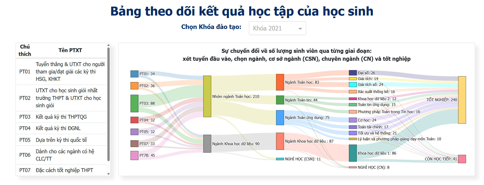
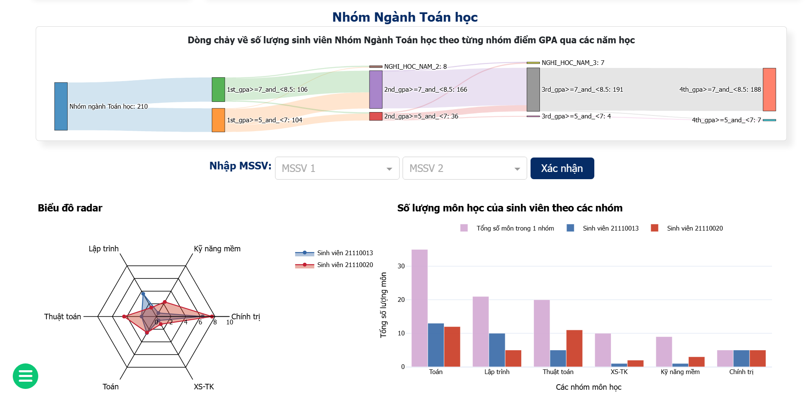
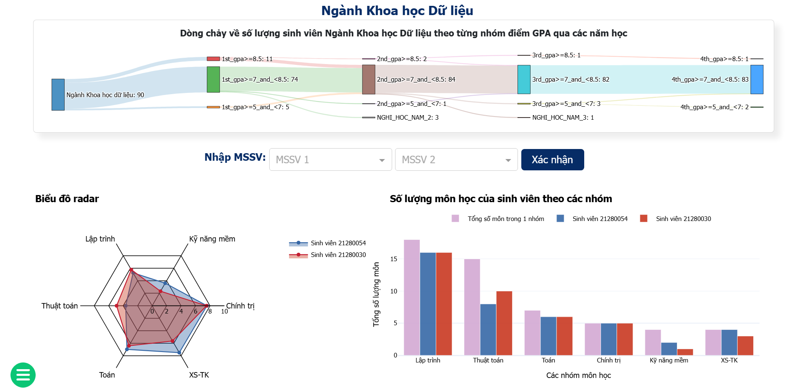
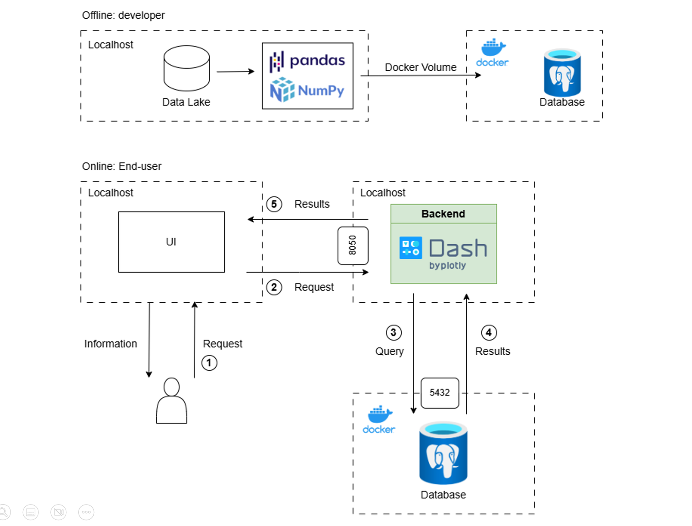

## HCMUS_Student_Dashboard

Interactive academic dashboard (Dash + Plotly) for **HCMUS – Faculty of Mathematics & Computer Science**, focusing on **student intake, study progress, GPA distribution, and major-level analytics** (Overview / Mathematics / Data Science).

### Overview Dashboard


### Mathematics Analytics


### Data Science Analytics

---

## Features



- **Multi-page Dash app**
  - Home dashboard + About page (`pages/`)
  - Sidebar navigation + responsive layout (Bootstrap)
- **Analytics modules by major**
  - `Overview`: intake overview + application form breakdown + Sankey flow (field → subfield → major) + overall charts
  - `Mathematics` & `DataScience`: student-level analytics (radar chart, course-group bar chart, detail tables)
- **Visualizations**
  - Sankey diagrams (student flow)
  - Donut chart (intake totals)
  - Horizontal bar chart (GPA distribution by year range & bucket)
  - Radar chart (compare selected students)
  - Tables for student details
- **Database-backed**
  - PostgreSQL storage with provided CSV datasets (`data/*.csv`)
  - Admin UI via **pgAdmin** (Docker)

---

## Tech Stack

- **Python**: Dash, Plotly, Pandas
- **UI**: dash-bootstrap-components, custom CSS/assets (`assets/`)
- **Database**: PostgreSQL
- **DB access**: SQLAlchemy + psycopg2
- **Deployment (DB)**: Docker Compose (Postgres + pgAdmin)

---

## Project Structure

```text
HCMUS_Dashboard_BACKUP_020625/
├── app.py                      # Main Dash app entry
├── pages/                      # Pages, routing, callbacks
│   ├── home.py
│   ├── about.py
│   ├── callback.py
│   └── config_vie.py           # Vietnamese labels / translations
├── majors/                     # Domain logic per module/major
│   ├── database_handler.py     # SQLAlchemy connector
│   ├── overview.py
│   ├── mathematics.py
│   └── datascience.py
├── utils/                      # Plot builders & preprocessing
│   ├── barchart.py
│   ├── color_utils.py
│   ├── constant.py
│   ├── donut.py                # SQL queries / constants
│   ├── preprocessing.py
│   ├── radarchart.py
│   ├── sankey.py
│   └── table.py             
├── data/                       # CSV data to load into Postgres
├── assets/                     # Images + CSS
├── docker-compose.yml          # Postgres + pgAdmin
└── tao-bang.txt                # SQL schema + COPY commands for CSV import
```

## Prerequisites
Python 3.x
Docker + Docker Compose (for PostgreSQL + pgAdmin)
Recommended: create a virtual environment

## Setup
1) Start Postgres + pgAdmin:
docker compose up -d
Postgres: localhost:5432
pgAdmin: http://localhost:5050
Default credentials (from docker-compose.yml):
Postgres user/pass: root / root
DB name: test_db
pgAdmin login: admin@admin.com / root

2) Import schema + CSV data
The file tao-bang.txt contains:
CREATE TABLE ...
COPY ... FROM '/var/lib/postgresql/data/data_files/<file>.csv' ...
Typical workflow:
Open pgAdmin → connect to Postgres → open Query Tool → paste/run the content of tao-bang.txt
Or use psql inside container (if you prefer CLI)
> Notes:
> - Ensure all CSV files exist under data/ and match the table columns.
> - Some dashboards depend on tables/views used in queries inside utils/constant.py (GPA-related queries are defined there).
Run the Dashboard (Local)
1) Install dependencies:
pip install -r requirements.txt
2) Run:
python app.py
3) Open the app (Dash default):
http://localhost:8050